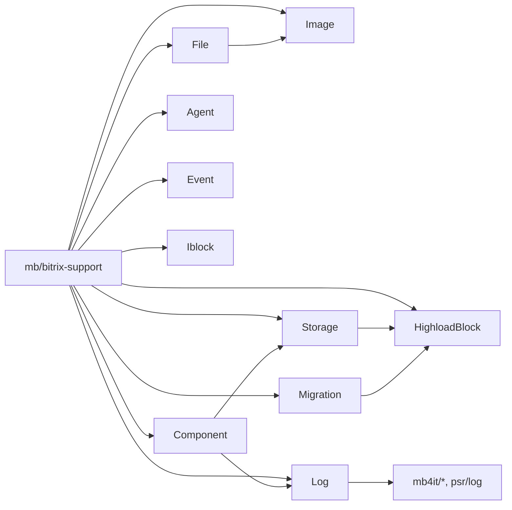

## Обзор пакета `mb/bitrix-support`

Пакет `mb/bitrix-support` — это набор вспомогательных классов и абстракций для Bitrix, который:

- упрощает **работу с файлами и изображениями** (включая поиск дубликатов и кэширование превью);
- даёт удобный слой над **ORM и Highload-блоками** (описание сущностей в коде и их синхронизация с БД);
- предоставляет базовую инфраструктуру для **миграций, компонентов, агентов и событий**;
- добавляет единый подход к **логированию и уведомлениям** через `psr/log` и стандартные механизмы Bitrix;
- включает дополнительные утилиты для **работы с инфоблоками, пользовательскими типами полей и поиском классов**.

Пакет оформлен как Composer-зависимость и использует пространство имён `MB\Bitrix\`.

---

## Требования и зависимости

Основные зависимости (см. `composer.json`):

- **PHP / Bitrix**: проект должен работать внутри Bitrix и иметь доступ к его ядру;
- **`mb4it/stringable`**, **`mb4it/collections`**, **`mb4it/conditionable`**, **`mb4it/filesystem`** – базовые утилиты и коллекции;
- **`spatie/image`** `^3.8` – для обработки изображений;
- **`psr/log`** `^1.0|^2.0|^3.0` – интерфейсы для логирования;
- **`ext-fileinfo`** – расширение PHP для определения MIME-типа.

Автозагрузка:

```json
"autoload": {
  "psr-4": {
    "MB\\Bitrix\\": "src/"
  }
}
```

---

## Установка

Добавьте зависимость в `composer.json` вашего проекта (или установите через Composer напрямую):

```bash
composer require mb/bitrix-support
```

Убедитесь, что в автозагрузке вашего проекта настроен Composer, а модуль Bitrix, внутри которого вы планируете использовать пакет, подключает `vendor/autoload.php`.

Пространство имён всех классов пакета: `MB\Bitrix\…`.

---

## Быстрый старт: сохранение файла

Один из самых частых сценариев — сохранение файла в Bitrix с дополнительной логикой:

- валидация входных данных;
- нормализация массива `$_FILES`;
- проверка дубликатов по размеру и хешу;
- сохранение физического файла и запись строки в таблицу `b_file`;
- возврат `FILE_ID` или `null`, а также вспомогательные методы для чтения данных файла.

Пример базового использования `FileService`:

```php
use MB\Bitrix\File\FileService;

// Например, $_FILES['PHOTO']
$fileData = $_FILES['PHOTO'] ?? null;

if ($fileData) {
    $fileId = FileService::saveFile(
        $fileData,
        'my_module/photos', // относительный путь в каталоге upload
    );

    if ($fileId) {
        $fileInfo = FileService::getFileData($fileId);
        // $fileInfo содержит расширенные данные файла
    }
}
```

За подробностями по работе с файлами и изображениями см. файл
[`docs/file-and-image.md`](file-and-image.md).

---

## Основные разделы документации

Документация разбита на несколько файлов:

- **`file-and-image.md`** – работа с файлами и изображениями;
- **`storage-and-highloadblock.md`** – надстройка над ORM и Highload-блоками;
- **`migrations.md`** – миграции и менеджеры сущностей;
- **`components.md`** – базовый компонент Bitrix и параметры;
- **`logging-and-events.md`** – логирование и уведомления;
- **`agents-and-events.md`** – агенты и обработчики событий;
- **`storage-advanced.md`** – дополнительные возможности хранилища;
- **`iblock-and-usertypes.md`** – работа с инфоблоками и пользовательскими типами полей;
- **`finder-and-utils.md`** – утилиты и поиск классов.

---

## Диаграмма подсистем пакета

Ниже — упрощённая схема основных подсистем пакета и их связей:



Краткое описание подсистем:

- **File / Image** – сохраняют файлы и обрабатывают изображения с учётом дубликатов и кэша;
- **Storage / HighloadBlock / Migration** – упрощают описание сущностей и синхронизацию схемы БД;
- **Component** – базовый компонент Bitrix с унифицированной работой с ошибками и параметрами;
- **Log** – единый интерфейс логирования в файл, журнал событий и панель уведомлений;
- **Agent / Event** – регистрация и обслуживание агентов и обработчиков событий;
- **Iblock** – утилиты для инфоблоков и пользовательских типов полей;
- **Finder / Traits / Utils** – служебные классы и трейты, используемые внутри других частей пакета.

---

## Где искать детали

Для детального описания и примеров использования откройте соответствующие файлы:

- работа с файлами и изображениями – [`file-and-image.md`](file-and-image.md);
- ORM, хранилище и Highload-блоки – [`storage-and-highloadblock.md`](storage-and-highloadblock.md), [`storage-advanced.md`](storage-advanced.md);
- миграции – [`migrations.md`](migrations.md);
- компоненты – [`components.md`](components.md);
- логирование и уведомления – [`logging-and-events.md`](logging-and-events.md);
- агенты и события – [`agents-and-events.md`](agents-and-events.md);
- инфоблоки и пользовательские типы – [`iblock-and-usertypes.md`](iblock-and-usertypes.md);
- утилиты и поиск классов – [`finder-and-utils.md`](finder-and-utils.md).

